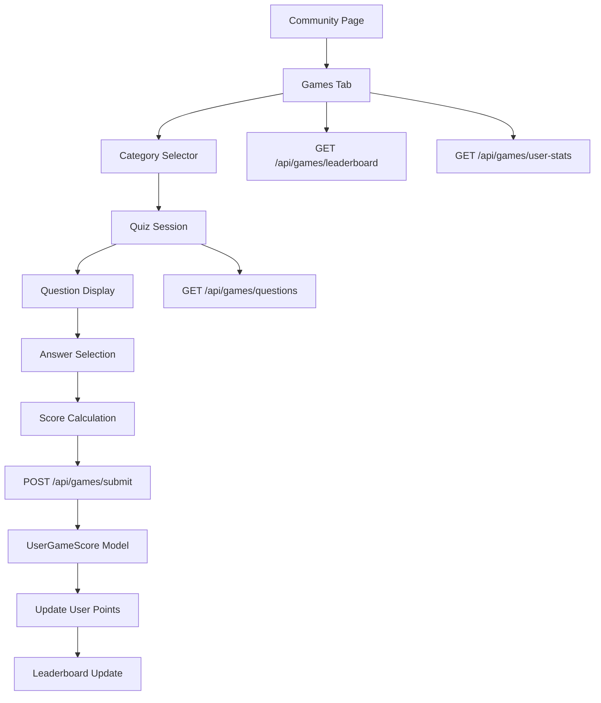
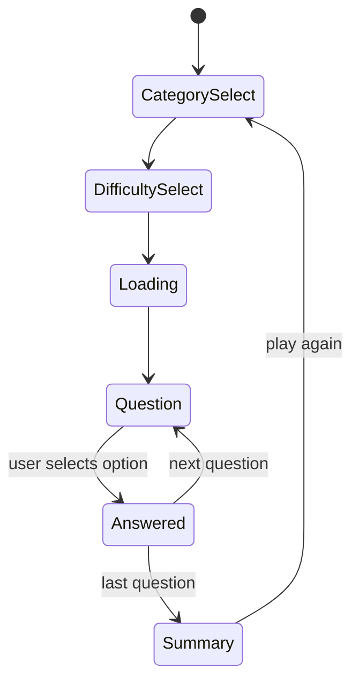

# Islamic Games Feature Plan

## Overview

Add a **Games** tab to the Community page that hosts Islamic quiz contests. Users answer questions, earn points, and appear on a leaderboard. The feature is fully integrated with the existing auth system and MongoDB backend.

---

## Architecture Diagram



---

## Data Models

### 1. `GameQuestion` Model — `backend/src/models/GameQuestion.ts`

```
{
  _id: ObjectId
  category: enum [quran, hadith, fiqh, seerah, general, arabic]
  difficulty: enum [easy, medium, hard]
  question: string
  options: string[4]          // 4 multiple-choice options
  correctIndex: number        // 0-3
  explanation: string         // shown after answer
  points: number              // easy=10, medium=20, hard=30
  timeLimitSeconds: number    // default 30
  createdAt: Date
}
```

### 2. `UserGameScore` Model — `backend/src/models/UserGameScore.ts`

```
{
  _id: ObjectId
  userId: ObjectId (ref: User)
  totalPoints: number
  gamesPlayed: number
  correctAnswers: number
  totalAnswers: number
  categoryStats: {
    quran: { points, correct, total }
    hadith: { points, correct, total }
    fiqh: { points, correct, total }
    seerah: { points, correct, total }
    general: { points, correct, total }
    arabic: { points, correct, total }
  }
  streak: {
    current: number
    best: number
    lastPlayedDate: Date
  }
  badges: string[]            // earned badge IDs
  rank: number                // computed, not stored
  updatedAt: Date
}
```

---

## Points & Scoring System

| Difficulty | Base Points | Time Bonus |
|------------|-------------|------------|
| Easy       | 10          | +5 if answered in <10s |
| Medium     | 20          | +10 if answered in <15s |
| Hard       | 30          | +15 if answered in <20s |

**Streak Bonus:** Consecutive correct answers multiply points:
- 3 in a row: 1.5x
- 5 in a row: 2x
- 10 in a row: 3x

**Badges:**
- 🌟 First Quiz — complete first game
- 📖 Quran Scholar — 100 correct Quran questions
- 🕌 Hadith Master — 100 correct Hadith questions
- 🔥 On Fire — 10-answer streak
- 🏆 Champion — reach top 10 leaderboard

---

## Backend API Routes — `backend/src/routes/games.ts`

| Method | Endpoint | Auth | Description |
|--------|----------|------|-------------|
| GET | `/api/games/questions` | Optional | Get N questions by category/difficulty |
| POST | `/api/games/submit` | Required | Submit quiz session answers, get points |
| GET | `/api/games/leaderboard` | Public | Top 20 users by total points |
| GET | `/api/games/user-stats` | Required | Current user's score, badges, stats |
| GET | `/api/games/categories` | Public | List available categories with question counts |

### `GET /api/games/questions`
Query params: `category`, `difficulty`, `limit` (default 10)
Returns: array of questions **without** `correctIndex` (sent only in submit response)

### `POST /api/games/submit`
Body:
```json
{
  "answers": [
    { "questionId": "...", "selectedIndex": 2, "timeSpentSeconds": 12 }
  ],
  "category": "quran",
  "difficulty": "medium"
}
```
Returns: `{ pointsEarned, correctCount, totalCount, breakdown[], newTotalPoints, newBadges[] }`

---

## Frontend Components

### New File: `frontend/src/components/IslamicGames.tsx`

Sub-components:
- **`GameCategoryCard`** — clickable card for each category with icon, question count, user's best score
- **`QuizSession`** — manages quiz state machine: `idle → loading → question → result → summary`
- **`QuestionCard`** — displays question, 4 answer buttons, countdown timer bar
- **`ScoreSummary`** — post-quiz breakdown: points earned, correct/total, badges unlocked, share button
- **`Leaderboard`** — top 20 users table with rank, avatar, username, points, badges
- **`UserStatsCard`** — current user's rank, total points, accuracy %, streak

### Quiz State Machine



---

## Community.tsx Changes

1. Add `games` to the `tabs` array with a `TrophyIcon` (heroicons)
2. Add `{ id: 'games', name: 'Games', icon: TrophyIcon }` tab entry
3. Render `<IslamicGames />` when `activeTab === 'games'`
4. Remove the "Under Construction" popup (or update progress to 80%)

---

## Daily Challenge Mode

### Concept
- Every day at midnight UTC, a **new set of 5 curated questions** is generated (one from each category, mixed difficulty)
- Each user can only play the Daily Challenge **once per day**
- Completing it earns **2x point multiplier** + streak bonuses
- A **daily streak counter** tracks consecutive days played

### Daily Streak Rewards

| Streak | Bonus |
|--------|-------|
| 3 days | +50 bonus points |
| 7 days | +150 bonus points + Weekly Warrior badge |
| 30 days | +500 bonus points + Ramadan Spirit badge |

### How Daily Questions Are Selected
- Questions are **deterministically selected** using the current UTC date as a numeric seed
- No extra DB storage needed for the question set — same 5 questions for all users on a given day
- Selection algorithm: `seed = YYYYMMDD integer → shuffle question pool with seeded RNG → pick first 5`

### Updated `UserGameScore` Model — `dailyChallenge` field

```
dailyChallenge: {
  lastPlayedDate: string        // "YYYY-MM-DD"
  lastPlayedScore: number       // points earned on last daily
  currentStreak: number
  bestStreak: number
  totalDaysPlayed: number
}
```

### New API Endpoints

| Method | Endpoint | Auth | Description |
|--------|----------|------|-------------|
| GET | `/api/games/daily-challenge` | Required | Get today's 5 daily questions + user's completion status |
| POST | `/api/games/daily-challenge/submit` | Required | Submit daily answers, award 2x points + streak bonus |

### Frontend: Daily Challenge Banner
- Prominent card at the **top of the Games tab** (above category cards)
- Shows countdown timer to next challenge (resets at midnight UTC)
- Shows "Completed Today — X pts earned" if already played
- Shows "X day streak!" to motivate return visits
- Locked behind login gate (same as quiz play)

---

## Seed Data

Pre-populate `GameQuestion` collection with at least:
- 20 Quran questions (easy/medium/hard)
- 20 Hadith questions
- 10 Fiqh questions
- 10 Seerah questions
- 10 General Islamic knowledge questions

Questions are seeded via a seed script or inline in the route file as static data (since the backend uses MongoDB Memory Server in dev).

---

## File Changes Summary

### New Files
| File | Purpose |
|------|---------|
| `backend/src/models/GameQuestion.ts` | Mongoose model for quiz questions |
| `backend/src/models/UserGameScore.ts` | Mongoose model for user scores |
| `backend/src/routes/games.ts` | Express routes for games API |
| `frontend/src/components/IslamicGames.tsx` | Full games UI component |

### Modified Files
| File | Change |
|------|--------|
| `backend/src/index.ts` | Import and register `/api/games` route |
| `frontend/src/pages/Community.tsx` | Add Games tab, import IslamicGames component |

---

## Design Principles

- **Emerald/Teal color scheme** — consistent with existing HikmahSphere design
- **Mobile-first** — quiz cards stack vertically on small screens
- **Accessible** — keyboard navigable answer buttons, ARIA labels
- **Optimistic UI** — answer feedback shown immediately, points calculated client-side then confirmed by server
- **No external dependencies** — uses existing React, Tailwind, heroicons, axios stack
